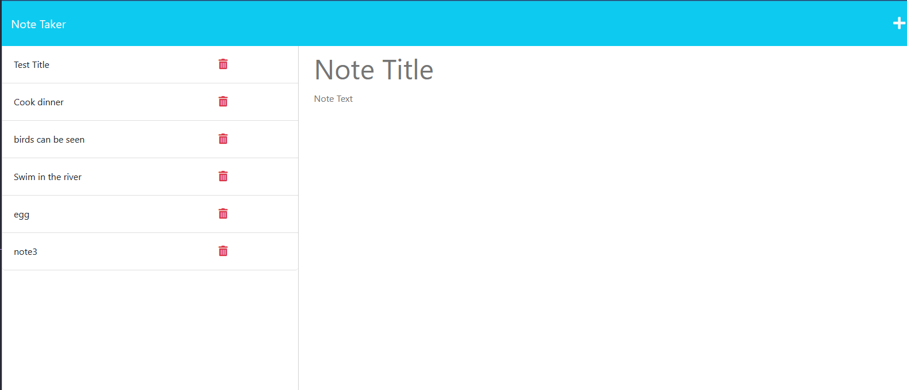

# ExpressJSNoteTaker
[heroku site](https://obscure-sea-77592-a98dd628cc00.herokuapp.com/)

## Table of Contents
-[Description](#description)
-[Usage](#usage)
-[Questions](#questions)
-[References](#references)

## Description 

Here we have an application that allows the user to create and store plans. It uses expressjs and heroku to run and organize files on a server. Aswell as has front end content for a user to interact with. 

## Usage
Pressing the blue Get Started button opens to a different route with the notes stored from the last time you used the site. Here you can create a new note by typing in a title and note body. When there are characters in the title a floppydisk save icon appears in the top right which will save your note.

## Questions

[myGitHub](https://github.com/Teelsam?tab=repositories)

## Resources 

[heroku instructions](https://devcenter.heroku.com/articles/getting-started-with-nodejs)

Helper files taken from class, express lesson 21-Ins_Modular-Routing/Modularized folder (`fsUtils.js` and `uuid.js`).